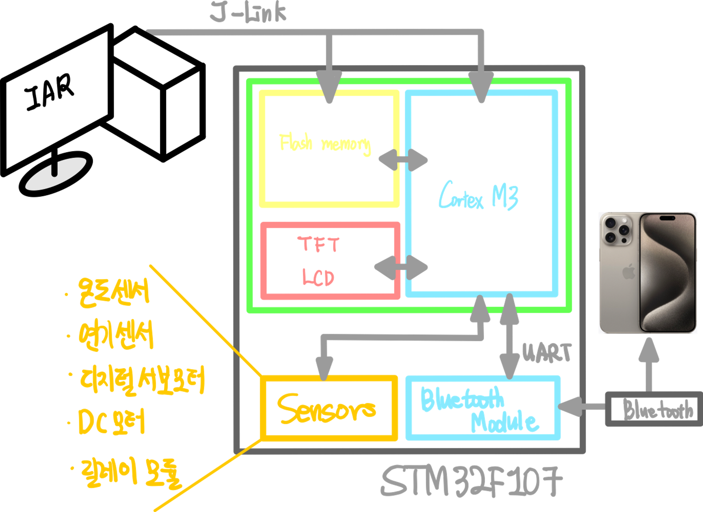
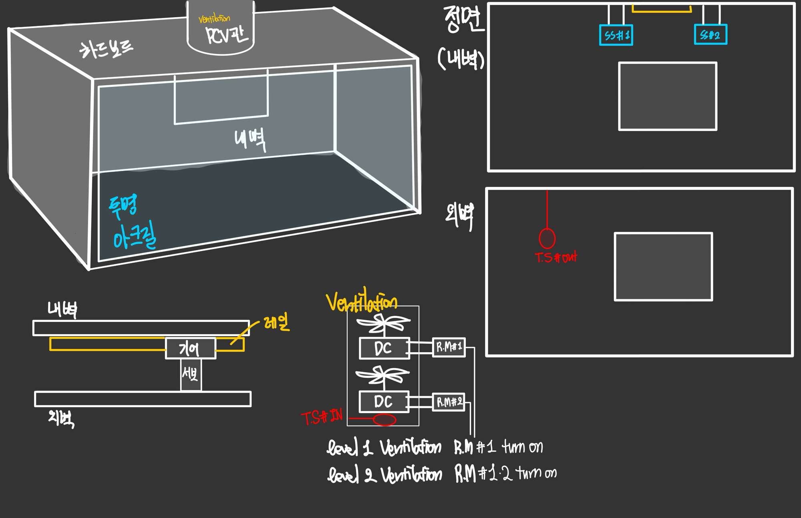
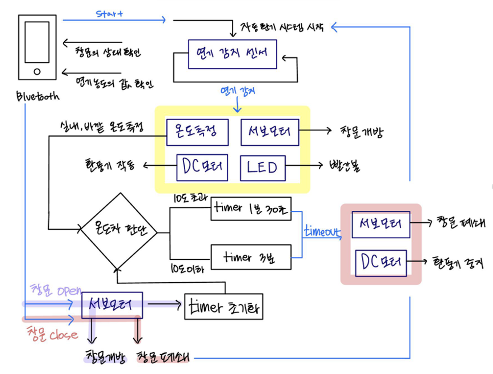

# Embedded-term

## 기능

**1) 연기** **감지** **및** **환기** **기능**

- **연기** **센서**가 일정 농도 이상의 연기를 감지하면 서보 모터를 이용해 **창문을** **개방(서보** **모터와** **플라스틱** **레크** **레일을** **활용)**하여 환기를 시킨다. 그리고 동시에 **DC 모터(릴레이** **모듈로 ON/OFF)**로 이루어진 환풍기를 작동시킨다. 이 때 붉은 색 **LED**가 indicator로서 켜진다.
- 자동으로 열린 창문은 보드 내장 **타이머**로 시간을 측정하여 일정 시간 후 자동으로 닫힌다. 창문 바깥의 온도와 실내의 **온도를** **측정**한 후, 그 값의 차가 10도 이하일 때는 3분 간 환기시키고, 값의 차가 일정 수치 이상일 때는 1분 30초만 환기시킨 후 창문을 닫는다.

**2) Bluetooth (모바일) 원격** **제어** **기능**

- 전체 시스템을 가동할 때, **Serial Bluetooth Terminal**에서 ‘start’를 입력하여 전체 시스템을 구동시킨다. start를 누르면 이제 시스템이 작동을 시작하는 것이다. 자동 창문 환기 시스템이 작동한다.
- 블루투스 통신을 통해 창문의 상태를 확인할 수 있다. 이 때, 연기 농도의 좋고 나쁨 정도도 함께 확인할 수 있다.
- 블루투스 통신을 통해 연기 농도에 상관없이 창문을 원격으로 열 수 있다. 만약 원격으로 창문을 열어놓은 경우, 환기 제한시간이 다 되어도 상관없이 열려 있다. 원격 환기 상태를 해제할 경우, 타이머는 정상적으로 작동한다.

**3) 추가기능 - 가능하면** **구현**

- 실내에 LCD를 장착하여 현재 연기 농도와 창문의 상태(열림/ 닫힘)를 출력한다. 덧붙여 남은 자동 환기 시간도 함께 출력한다.

## 시나리오

**1) 자동** **환기** **시스템** **시작** **전**

- Serial Bluetooth Terminal에서 ‘start’를 입력하여 자동 환기 시스템 가동을 시작한다.

**2) 자동** **환기** **시스템** **시작** **후**

- 연기 감지 센서를 시작하고, Interrupt를 이용해 연기의 농도를 감지한다.

**3) 연기** **감지** **시**

- 실내 온도와 실외 온도를 측정한다.
- 서보 모터를 이용하여 창문을 개방한다.
- DC 모터(환풍기)를 작동시킨다.
- 빨간색 LED가 켜진다.

**4) 자동** **환기** **시스템에** **의해** **창문이** **열린** **후**

- 측정한 실내 온도와 실외 온도의 차가 10도 이하일 경우 보드의 내장 타이머를 작동시키고 3분동안 환기를 유지한다.
- 실내 온도와 바깥의 온도의 차가 10도보다 클 경우 보드의 내장 타이머를 작동시키고 1분 30초동안 환기를 유지한다.

**5) 제한** **시간이** **끝난** **후**

- 자동으로 창문을 닫는다.
- DC 모터(환풍기)를 중지시킨다.

**6) 블루투스** **통신**

- 항시 창문의 상태를 확인할 수 있다.
- 항시 연기 농도의 값을 확인할 수 있다.
- 연기 농도에 관계 없이, 창문을 원격으로 열 수있다. 원격으로 창문을 열었을 경우에는 타이머를 초기화시킨다. 원격으로 창문을 여는 것을 중단한 경우, 자동 환기 시스템을 활성화한다.

## 사용 센서

- Smoke Sensor [GSAS61] 
( https://www.devicemart.co.kr/goods/view?no=9833 )
- 5V 학생실습용 DC모터 [SZH-MT001] 
(http://www.devicemart.co.kr/1287094)
- 디지털 서보모터 :[TowerPro] [정품] SG90 360도 디지털 서보모터
(http://www.devicemart.co.kr/12503476)
- 온도센서 **[NS] LM35DZ** 
([http://www.devicemart.co.kr/3183](https://www.devicemart.co.kr/goods/view?no=3183))

## 흐름도 & 구상도

## 기능 분류

- [ ]  전체 HW Configure
    - [x]  블루투스 Configuration
- [ ]  온도 센서 ADC 값 제대로 받아오기
    - [x]  온도 센서 값 변동이 미미함. 다시 확인하기
- [ ]  LCD 상에 On/Off 제대로 나타나게
- [ ]  DC모터 - 릴레이 모듈 (5week)
- [ ]  블루투스 모듈 (9week)
    - [ ]  시스템 시작 기능
    - [ ]  창문 상태 값 받아와 출력 기능
    - [ ]  연기 농도 값 받아와 출력 기능
    - [ ]  창문 open 기능
    - [ ]  창문 close 기능
- [ ]  (Interrupt, 7week) ADC
    - [ ]  연기 감지 (10week) 기능
    - [ ]  온도 측정 기능
    - [ ]  LCD (10week)
- [ ]  Timer (11week)
    - [ ]  timeout에 따른 서보 모터 제어 (창문 close)
    - [ ]  timeout에 따른 DC 모터 제어 (환풍기 stop)
- [ ]  납땜

## 공작 준비물

- [x]  아크릴→ PVC
- [ ]  하드보드지
- [ ]  프로펠러
- [x]  글루건
- [x]  칼
- [x]  가위
- [x]  자
- [x]  줄자
- [x]  마킹용 유성펜
- [ ]  부품(수령시 체크)